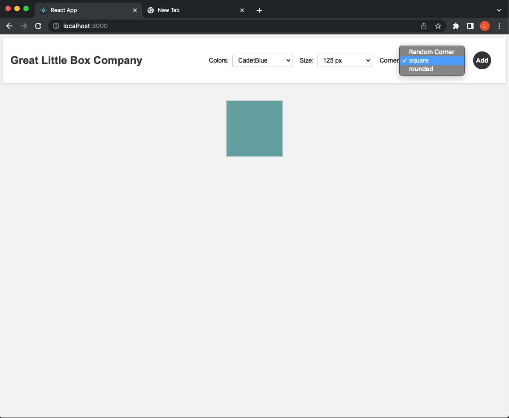
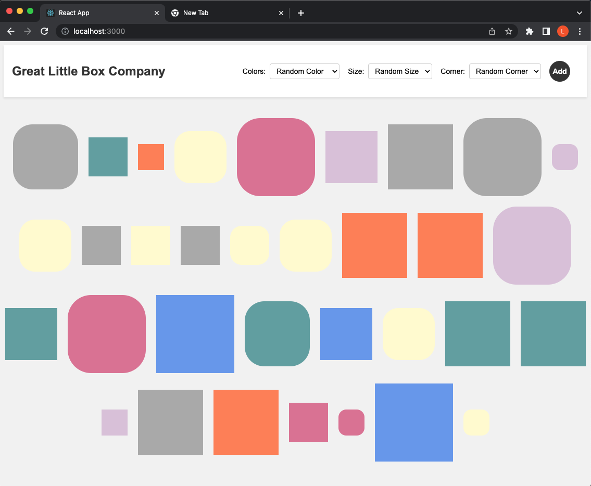

# Core Assignment "Box Generator"

This is Christian Johnson's work for Coding Dojo's Part-Time Accelerated MERN Stack.
It was submitted on April 19, 2023.

The project can be viewed [HERE](https://reactblocks.vercel.app/).

## Assignment description

This is a basic React application that accepts a color in an input field. When the form is submitted a box-shaped div is generated and placed next to previous form submissions wrapping as necessary.

## Additional Embeleshments

A valid color entry depends on the user's familiarty with named HTML colors. Since html color names can be esoteric (ever heard of 'RebeccaPurple') there was high probability of invalid color names. I decided to create an array of valid color names. This array is mapped to create `<option>` tags within the form's select tag. I additionally wanted a default option to come up with a random color. I then extended the form's functionality to include size options and rounded corners for the user to select.

